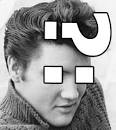

# Elvis

Elvis оператор не приносит нам чего-то нового.  
Он используется, чтобы написать if else в более короткой форме и в одну строчку.
Хоть это и выглядит заманчивым, но не всегда стоит сокращать свой код.

Читаемость кода гораздо важнее,
а разницы в производительности между этими операторами нет никакой. 

Поэкспериментируй с кодом и попробуй написать еще один elvis оператор.

Кстати, называется оператор так, потому что  `?:` напоминает прическу знаменитого Елвиса Пресли.

